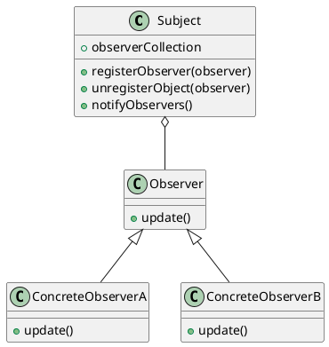

# Observer
## 概要
振る舞いに関するパターン。  
プログラム内のオブジェクトイベントを他のオブジェクトへ通知する処理で使われるデザインパターン。  
通知する側のオブジェクトが、通知される側のオブジェクトに観察される形になるから Observer と呼ばれる。  
出版-購読型モデルとも呼ばれる。暗黙的呼び出しの原則と関係が深い。
分散イベント処理システムの実装にも使われる。言語によっては、このパターンで扱われる問題は言語が持つイベント処理構文で処理される。
  
Observer　パターンでは観察対象の状態が変化すると観察者に対して通知されるため、状態変化に応じた処理を記述する時に有効。
Observerという言葉の本来の意味は「観察者」だが、実際には、Observer役は能動的に「観察」するのではなく、Subject役から「通知」されるのを受動的に待っていることになるので、Publish-Subscribeパターンと呼ばれることもある。

## クラス図

## サンプルプログラム
- 数をたくさん生成するオブジェクトを観察者が観察して、その値を表示する仕組み
- 表示の方法は、観察者によって異なる。
- DigitalObserverは、値を数字で表示する。
- GraphObserverは、値を簡易グラフで表示する。